# Ứng dụng Đặt Cơm Tấm

## Ảnh chụp giao diện ứng dụng
<table>
  <tr>
    <td>Đăng nhập</td>
    <td>Trang chủ</td>
    <td>Chọn danh mục</td>
  </tr>
  <tr>
    <td>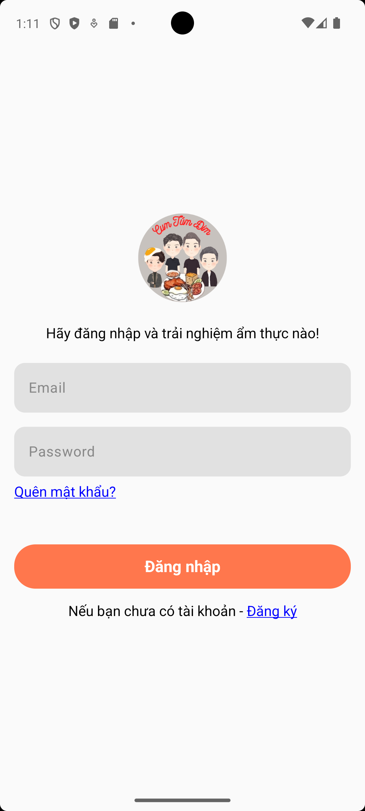</td>
    <td>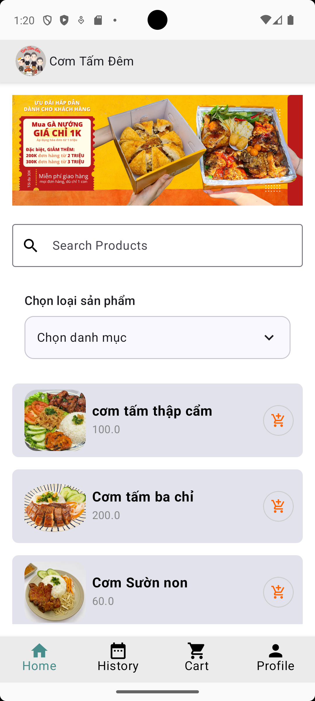</td>
    <td>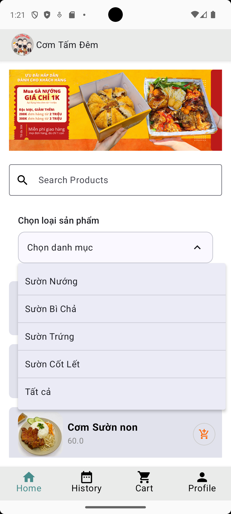</td>
  </tr>
  <tr>
    <td colspan="3"></td>
  </tr>
  <tr>
    <td>Kết quả lọc theo danh mục</td>
    <td>Giỏ hàng</td>
    <td>Thanh toán</td>
  </tr>
    <tr>
    <td>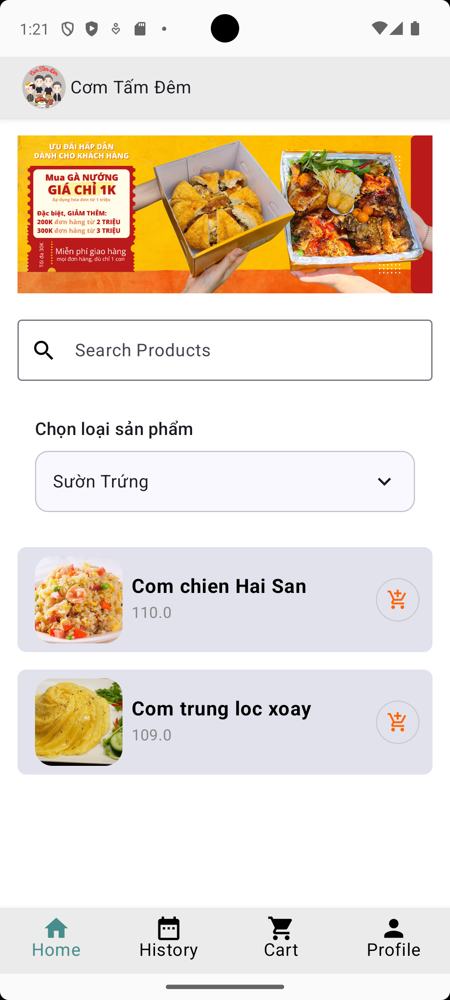</td>
    <td>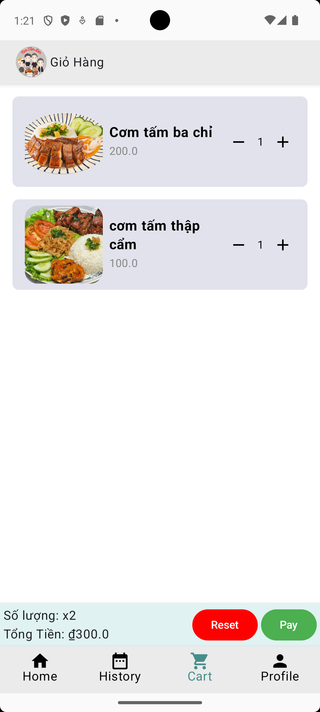</td>
    <td>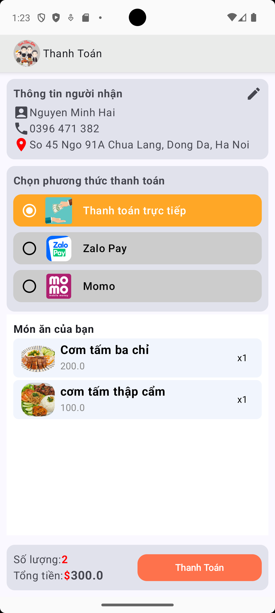</td>
  </tr>
  <tr>
    <td colspan="3"></td>
  </tr>
  <tr>
    <td>Xác nhận thanh toán</td>
    <td>Trạng thái đơn hàng</td>
    <td>Quản lý sản phẩm(Người bán)</td>
  </tr>
    <tr>
    <td>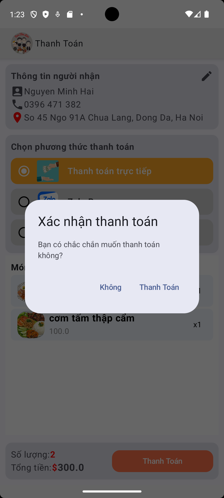</td>
    <td>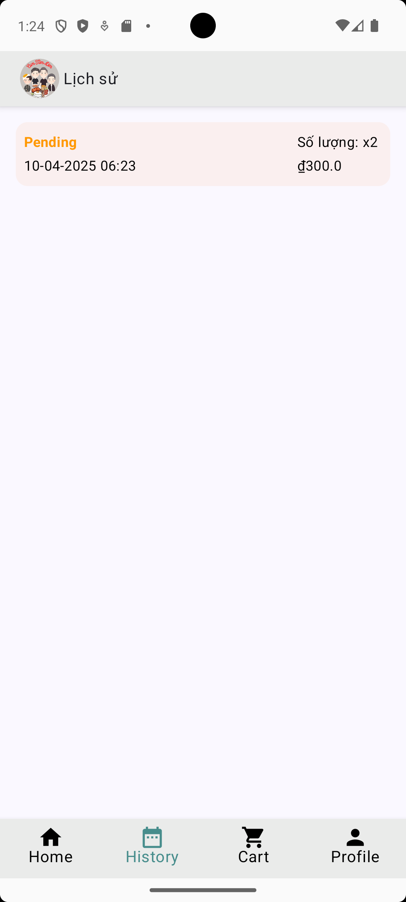</td>
    <td>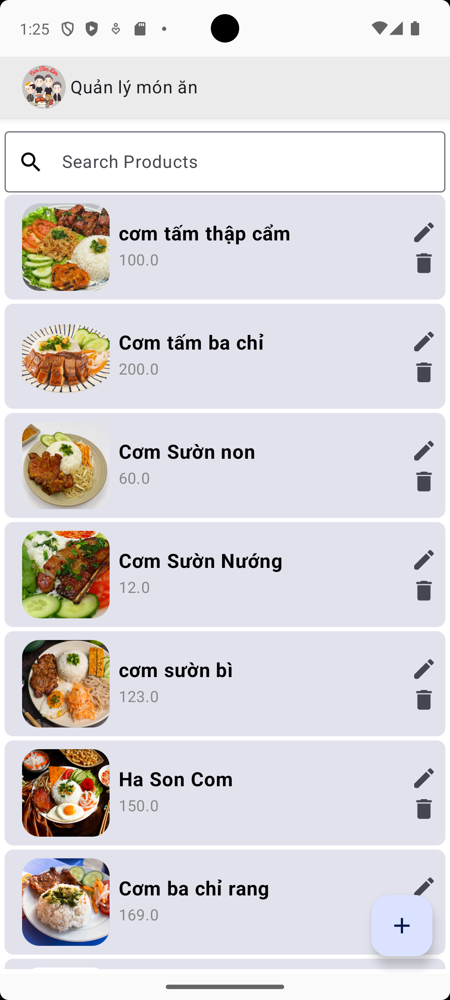</td>
  </tr>
  <tr>
    <td colspan="3"></td>
  </tr>
  <tr>
    <td>Quản lý sản phẩm(Người bán)</td>
    <td>Quản lý danh mục</td>
    <td>Quản lý Danh mục</td>
  </tr>
    <tr>
    <td>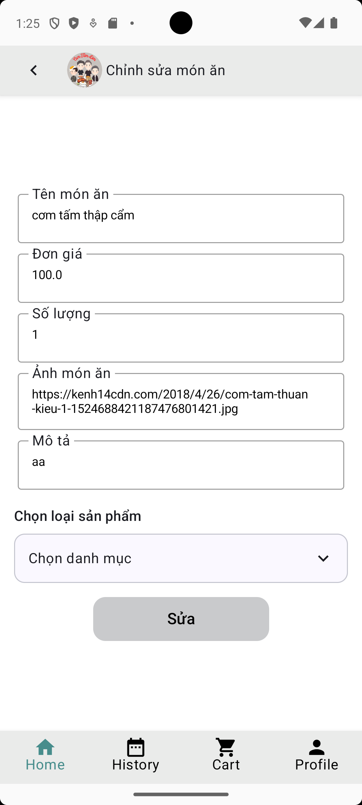</td>
    <td>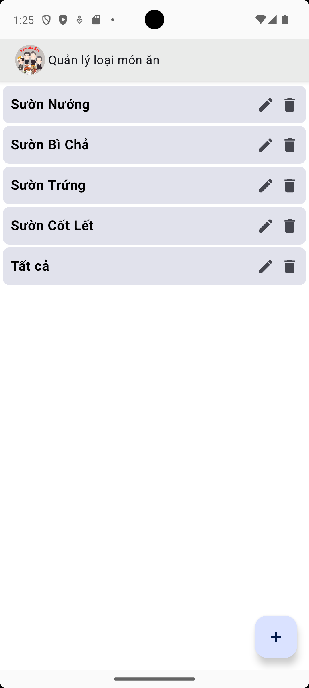</td>
    <td>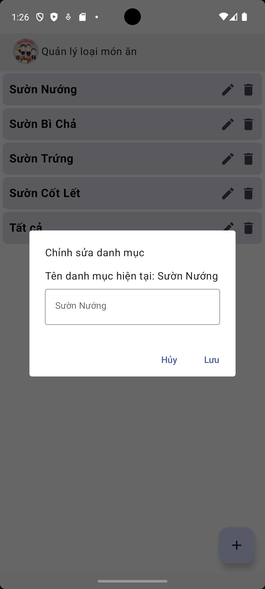</td>
  </tr>
  <tr>
    <td colspan="3"></td>
  </tr>
  <tr>
    <td>Chỉnh sửa thông tin cá nhân</td>
  </tr>
    <tr>
    <td>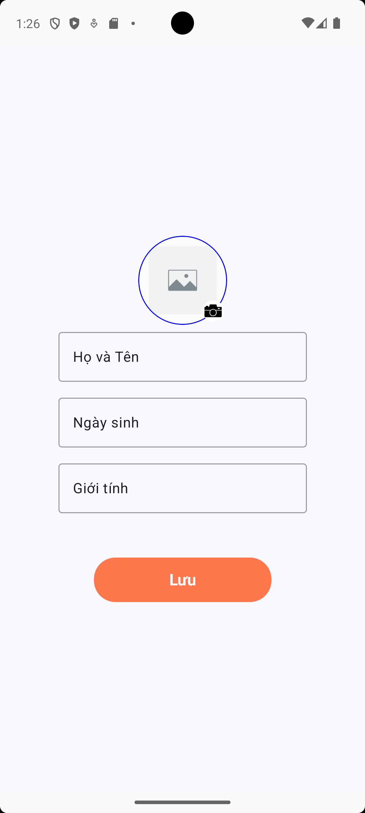</td>
  </tr>
  
</table>

Ứng dụng đặt món và quản lý nhà hàng Cơm Tấm được xây dựng với:
- **Frontend**: Android sử dụng Kotlin Compose (Jetpack Compose)
- **Backend**: Node.js
- **Database**: MongoDB

## Tính năng chính

### Cho khách hàng
- Đăng nhập/đăng ký tài khoản
- Duyệt menu món ăn với hình ảnh và mô tả
- Đặt món và thanh toán trực tuyến
- Theo dõi trạng thái đơn hàng

### Cho quản lý nhà hàng
- Quản lý menu (thêm/xóa/sửa món)
- Theo dõi và cập nhật trạng thái đơn hàng
- Thống kê doanh thu

## Công nghệ sử dụng

**Frontend (Android)**:
- Kotlin
- Jetpack Compose (UI)
- Retrofit (API calls)
- ViewModel & LiveData
- Coil (Image loading)

**Backend**:
- Node.js
- Express.js
- MongoDB (với Mongoose)
- JWT Authentication

## Cài đặt và chạy dự án

### Yêu cầu hệ thống
- Android Studio (cho frontend)
- Node.js 16+ (cho backend)
- MongoDB 4.4+

### Backend
1. Clone repository
2. Vào thư mục `backend`:
   ```bash
   cd backend
   npm install
3. Tạo file `.env` dựa trên `.env.example`
4. Chạy server:
   ```bash
   npm start
   ```

### Frontend (Android)
1. Mở project bằng Android Studio
2. Cập nhật base API URL trong file `NetworkModule.kt`
3. Chạy trên máy ảo hoặc thiết bị thật

## Cấu trúc thư mục
```
App_Com_Tam_Dem/
├── android-app/          # Frontend Kotlin Compose
│   ├── app/              # Main application module
│   └── build.gradle      # Project configuration
│
└── backend/              # Node.js server
    ├── controllers/      # Business logic
    ├── models/          # MongoDB models
    ├── routes/          # API endpoints
    ├── app.js           # Main server file
    └── package.json     # Dependencies
```

## Liên hệ
- Tác giả: Chảo Láo Lở
- Nếu bạn có bất kỳ câu hỏi nào về dự án, vui lòng liên hệ với tôi qua email: [chaolaolo290604@gmail.com](mailto:chaolaolo290604@gmail.com).
